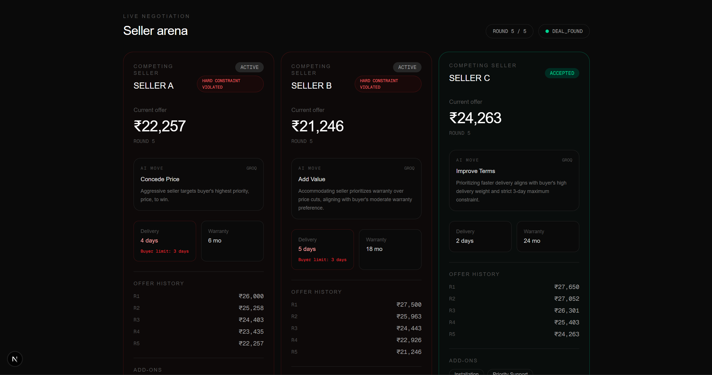
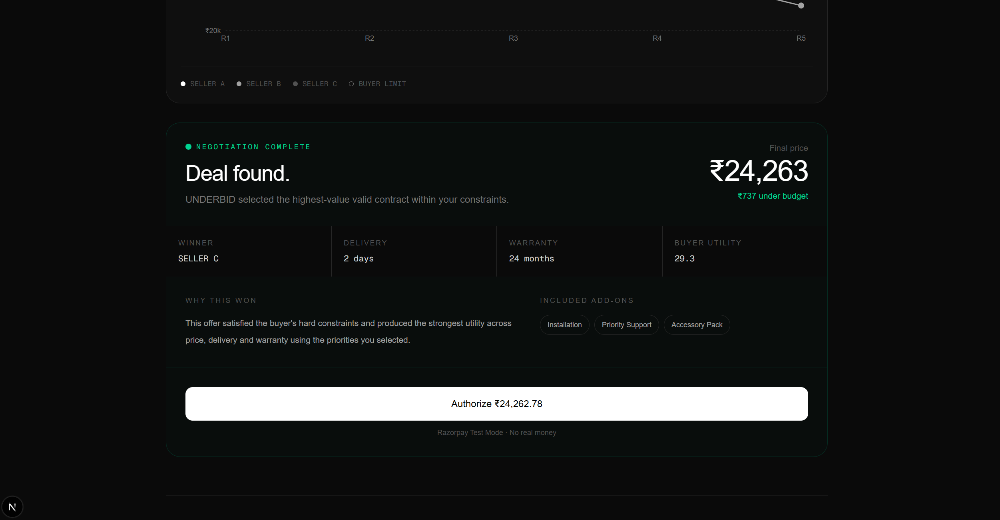
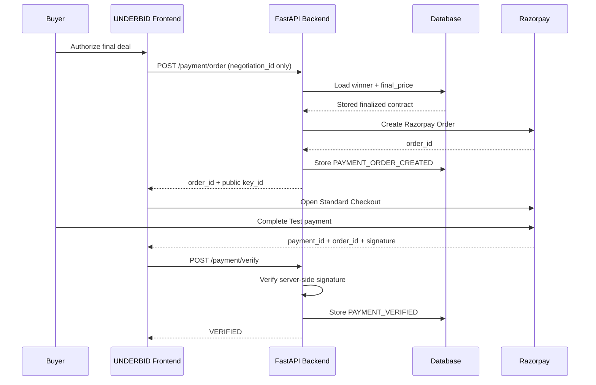
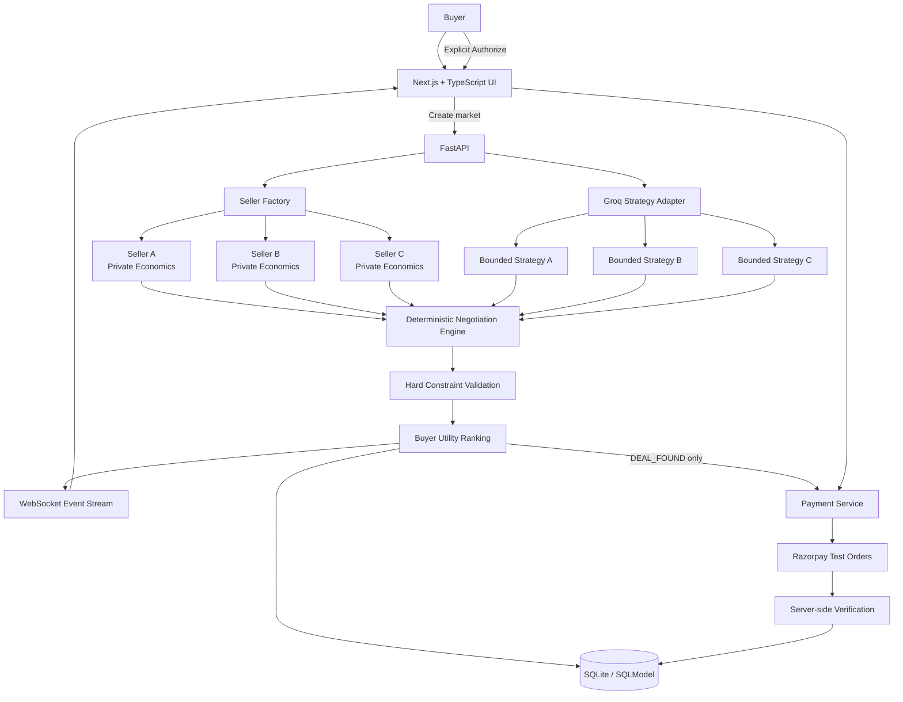

# UNDERBID

### Three virtual sellers compete to give you the best deal.

You set a hard budget, delivery limit and what matters most to you.  
Three independent seller agents compete for your purchase. UNDERBID evaluates every offer, rejects contracts that violate your constraints, selects the highest-value valid deal, and only then allows you to authorize payment.

**Built for the Razorpay AI Buildathon 2026.**

---

## Demo


A buyer asking for one product creates a small competitive market:

```text
Buyer
  │
  ├── Hard budget
  ├── Delivery deadline
  └── Price / Delivery / Warranty priorities
          │
          ▼
   ┌─────────────────┐
   │    UNDERBID     │
   └─────────────────┘
      │      │      │
      ▼      ▼      ▼
  SELLER A SELLER B SELLER C
      │      │      │
      └──────┼──────┘
             ▼
       Valid contracts
             │
             ▼
    Highest buyer utility
             │
             ▼
          DEAL
             │
      explicit approval
             ▼
    Razorpay Test Checkout
```

The interesting part is not the interface.

**The sellers actually have different private economics, strategies and constraints, and the result changes when the market changes.**

---

## The problem

Online shopping is still mostly a buyer-side comparison problem.

You open several tabs, compare:

- price,
- delivery,
- warranty,
- bundled services,
- and seller reputation,

then manually decide which compromise is acceptable.

But sellers already know the lowest deal they are willing to make.

**UNDERBID flips the direction of the marketplace.**

Instead of asking:

> “Which seller should I choose?”

the buyer says:

> “Here is my budget and what I care about. Compete for my purchase.”

---

## The core idea

A buyer specifies:

```text
Product:              Sony XM5
Hard budget:          ₹24,000
Maximum delivery:     4 days

Priorities:
Price                  50%
Delivery               41%
Warranty                9%
```

UNDERBID creates three competing sellers.

Each seller privately owns parameters such as:

```text
cost price
opening price
hard floor
concession rate
delivery options
warranty options
add-on costs
seller personality
```

These values are **not shown to the buyer while negotiation is running**.

The seller must negotiate without violating its own economics.

The buyer must never accept a contract outside its hard constraints.

---

# The most important design rule

## AI chooses what strategy to try. Code decides what is allowed.

This is the trust boundary of UNDERBID.

The LLM is **not allowed to invent money**.

It never decides:

```text
final price
seller floor
buyer budget
utility score
contract validity
winner
payment amount
payment authorization
```

Instead, the LLM chooses one bounded strategic action:

```text
HOLD
CONCEDE_PRICE
ADD_VALUE
IMPROVE_TERMS
```

The negotiation engine then executes that strategy through deterministic economic rules.

This means an LLM cannot suddenly decide:

> “₹18,000 sounds competitive.”

if the seller's private economics do not permit it.

### Responsibility split

| Decision | LLM | Deterministic engine |
|---|:---:|:---:|
| Choose negotiation strategy | ✅ | |
| Explain strategy rationale | ✅ | |
| Set seller floor | | ✅ |
| Calculate offer price | | ✅ |
| Enforce buyer budget | | ✅ |
| Enforce delivery constraint | | ✅ |
| Price delivery upgrades | | ✅ |
| Check add-on affordability | | ✅ |
| Calculate buyer utility | | ✅ |
| Select winner | | ✅ |
| Create payment amount | | ✅ |
| Verify Razorpay payment | | ✅ |

The result is an agentic system where **reasoning is flexible but money is bounded**.

---

# Why this is not a scripted demo

This was one of the main engineering goals.

A prerecorded negotiation with three hardcoded price sequences would look impressive once and fail immediately when a judge changed the input.

UNDERBID instead supports **randomized private markets**.

Clicking:

```text
🎲 Randomize Market
```

regenerates seller economics including combinations of:

```text
opening prices
floor prices
concession behaviour
delivery capabilities
warranty options
add-on costs
```

The same buyer request can therefore produce:

- a different winner,
- a different final price,
- a different number of rounds,
- or no agreement at all.

### Two real development runs

| Market | Buyer budget | Result | Rounds |
|---|---:|---|---:|
| #33 | ₹24,000 | SELLER B at ₹23,603.47 | 4 |
| #36 | ₹24,000 | SELLER A at ~₹20,254 | 1 |

Same budget.

Different hidden seller economics.

Different outcome.

That is exactly the behaviour expected from a market rather than a fixed demo.

### Multi-round example



A seller can gradually become more competitive as:

- rounds progress,
- competitive pressure changes,
- the seller approaches its private economic boundary,
- and its chosen negotiation strategy is applied.

A seller can also refuse to cross its floor and walk away.

---

# Negotiation mechanics

## 1. Private seller economics

Every seller has a `SellerConfig` containing economic constraints.

Conceptually:

```python
SellerConfig(
    cost_price=...,
    opening_price=...,
    floor_price=...,
    concession_rate=...,
    delivery_options=...,
    warranty_options=...,
    addon_costs=...,
    strategy=...,
)
```

The configuration itself is validated.

Among the invariants:

```text
floor_price >= cost_price
opening_price >= floor_price
concession_rate is bounded
delivery options must exist
warranty options must exist
add-on costs cannot be negative
```

A seller therefore cannot be created with internally impossible economics.

---

## 2. Simultaneous rounds

UNDERBID does not let later sellers in the same round unfairly react to earlier sellers.

All sellers in round `R` observe only the completed state of round `R-1`.

```text
ROUND R begins

Seller A ─┐
Seller B ─┼── read ROUND R-1
Seller C ─┘

       independently compute

Seller A ─┐
Seller B ─┼── publish ROUND R
Seller C ─┘
```

This keeps one seller from receiving accidental information simply because it executed later in a Python loop.

Maximum negotiation length:

```text
5 rounds
```

The system can terminate earlier when a valid deal is already available.

---

## 3. Hard constraints come before preferences

A low utility valid deal can still be considered.

An invalid deal cannot.

For example:

```text
Buyer budget = ₹24,000
Delivery limit = 4 days
```

Then:

```text
₹23,900 / 3 days     VALID
₹24,500 / 2 days     REJECTED — budget
₹22,900 / 5 days     REJECTED — delivery
```

Only valid offers enter buyer-utility comparison.

That prevents a highly attractive warranty or delivery package from "compensating" for breaking a hard financial constraint.

---

## 4. Multi-attribute buyer utility

Among valid contracts, UNDERBID does not blindly select the cheapest seller.

The buyer controls preference weights for:

```text
Price
Delivery
Warranty
```

The weights always total:

```text
100%
```

A price-sensitive buyer can favour savings.

A time-sensitive buyer can favour faster delivery.

A buyer who values long-term protection can increase warranty weight.

The winner is the valid contract with the highest weighted buyer utility.

### Deterministic tie-breaking

If two valid offers have equal utility, the engine uses a deterministic ordering:

1. higher buyer utility,
2. lower price,
3. faster delivery,
4. longer warranty,
5. seller name.

No random winner selection.

---

# Real-time market visualization


The frontend streams negotiation events over WebSockets.

Each seller card exposes:

- current offer,
- round number,
- current AI strategy,
- strategy rationale,
- delivery,
- warranty,
- add-ons,
- offer history,
- hard-constraint violations,
- buyer utility when valid.

The live convergence chart visualizes seller prices relative to the buyer's hard budget.

The UI is intentionally designed as a **market**, not as three ChatGPT windows.

The agents compete through structured contracts, not unbounded conversational text.

---

# Graceful failure is part of the product

A good financial agent should know when **not** to transact.

If every seller reaches an economic boundary before satisfying the buyer:

```text
NO DEAL
```

UNDERBID walks away.

It does not:

- exceed the buyer's hard budget,
- force a seller below its floor,
- select the "least bad" invalid offer,
- or initiate payment.


This is an intentional economic failure state, not an application error.

---

# Explainable by construction

Every important market action is represented as a structured event.

Examples include:

```text
ROUND_STARTED
OFFER_CREATED
SELLER_WALKED
DEAL_FOUND
NO_DEAL
PAYMENT_ORDER_CREATED
PAYMENT_VERIFIED
```

The UI exposes the negotiation audit trail directly.



A reviewer can inspect:

```text
which seller acted
which round it happened in
what offer was produced
which constraints were violated
which seller eventually won
what final price was authorized
```

The final outcome is therefore inspectable instead of being hidden behind an LLM response.

---

# Payment is deliberately gated

A negotiation agent should never automatically move money simply because it generated a deal.

UNDERBID separates:

```text
AGREEMENT
```

from:

```text
PAYMENT AUTHORIZATION
```

After a deal is found, the buyer explicitly sees:

```text
Authorize ₹23,603.47
```

and must click it.


---

## Razorpay payment flow



### A deliberately important detail

The frontend does **not** tell the backend:

```text
"Charge ₹23,603.47"
```

It sends only:

```text
negotiation_id
```

The backend retrieves:

```text
winner_seller_name
final_price
```

from its own stored negotiation.

This prevents a modified frontend request from changing the agreed payment amount.

The backend also stores the Razorpay `order_id` and verifies the payment response server-side.

---

## Razorpay Test Mode


The current project uses **Razorpay Test Mode**.

No real money is moved.

After successful signature verification:


```text
Payment verified.
Razorpay Test payment successfully verified.
```

The payment integration is therefore a functioning test transaction path, not a decorative "Pay" button.

---

# System architecture



---

# AI strategy layer

Seller strategies are chosen using Groq-hosted inference.

Current model:

```text
qwen/qwen3.6-27b
```

The strategy request contains relevant negotiation context such as:

```text
seller personality
buyer price weight
buyer delivery weight
buyer warranty weight
delivery constraint
```

The model must return one of four structured actions:

```text
HOLD
CONCEDE_PRICE
ADD_VALUE
IMPROVE_TERMS
```

plus a short rationale.

If the LLM is unavailable or produces an invalid response, UNDERBID falls back to a deterministic personality-based strategy.

The market therefore remains operational even when the external model provider fails.

---

# Seller strategy effects

### `HOLD`

Reduce price concession pressure.

Useful when a seller believes its current position is strong.

### `CONCEDE_PRICE`

Increase the deterministic concession rate.

The engine still prevents the seller from crossing its private floor.

### `ADD_VALUE`

Compete through configured services or add-ons where economics permit.

### `IMPROVE_TERMS`

Prefer stronger non-price contract terms such as delivery or warranty.

This creates negotiation over an actual **contract**, not just one scalar number.

---

# Proof that money stays deterministic

Seller pricing uses decimal arithmetic rather than floating-point guesses.

```text
Money → Decimal
Precision → 2 decimal places
```

Seller configurations enforce:

```text
floor >= cost
opening >= floor
```

The runtime offer path cannot cross the private floor.

The buyer cannot accept an offer above its budget.

Payment cannot start without a persisted final winner and final price.

The LLM never receives authority to bypass any of these checks.

---

# Validation

UNDERBID was tested at several layers.

## Backend engine/API parity

```bash
python -m pytest -v
```

Current automated suite verifies that the API negotiation and direct engine execution remain consistent under fixed strategies, while private seller configuration stays separated from the public negotiation representation.

Development result:

```text
1 passed
```

---

## Frontend static validation

```bash
npm run lint
npm run build
```

Validated with:

```text
ESLint                  PASS
Next.js production build PASS
TypeScript               PASS
Static page generation   PASS
```

---

## Randomized market validation

During development the simulator was exercised across 100 randomized markets.

Observed:

```text
100 simulations completed
all sellers capable of winning
53 distinct winning prices
47 no-deal outcomes
```

The purpose of this test was not to optimize a benchmark score.

It was to answer a more important question:

> Does changing the market actually change the outcome?

The answer was yes.

**[Attach terminal validation proof here if available]**


---

# Example: one market from end to end

Buyer:

```text
Product             Sony XM5
Budget              ₹24,000
Max delivery        4 days

Price priority      50%
Delivery priority   41%
Warranty priority    9%
```

Randomized market:

```text
SELLER A
₹20,254
4-day delivery
6-month warranty
Strategy: CONCEDE_PRICE

SELLER B
₹27,214
3-day delivery
18-month warranty
INVALID: ABOVE BUYER BUDGET

SELLER C
₹29,219
1-day delivery
24-month warranty
INVALID: ABOVE BUYER BUDGET
```

Result:

```text
Winner       SELLER A
Price        ₹20,254
Budget       ₹24,000
Savings      ~₹3,746
Delivery     4 days
Warranty     6 months
```

Seller A wins not because the LLM declares it the winner, but because:

```text
1. its contract satisfies every hard constraint
2. the other two contracts violate the buyer budget
3. the deterministic evaluator selects from valid offers
```

The buyer can then explicitly authorize that persisted contract through Razorpay Test Checkout.

---

# Tech stack

| Layer | Technology |
|---|---|
| Frontend | Next.js, React, TypeScript |
| Styling | Tailwind CSS |
| Visualization | Recharts |
| Backend | FastAPI, Python |
| Realtime | WebSockets |
| Validation | Pydantic |
| Database | SQLite + SQLModel |
| Money arithmetic | Python `Decimal` |
| Negotiation | Custom deterministic engine |
| LLM strategy | Groq + Qwen |
| Payment | Razorpay Orders + Standard Checkout |
| Testing | Pytest, ESLint, Next.js production build |

There is deliberately no heavyweight multi-agent orchestration framework.

The negotiation state machine, economic constraints and market mechanics are implemented directly so the behaviour remains inspectable.

---

# Project structure

```text
underbid/
│
├── backend/
│   ├── agents/
│   │   ├── strategy.py
│   │   └── narrator.py
│   │
│   ├── database.py
│   ├── main.py
│   ├── manager.py
│   ├── models.py
│   ├── payments.py
│   ├── schemas.py
│   ├── seller_factory.py
│   └── service.py
│
├── negotiation/
│   ├── buyer.py
│   ├── engine.py
│   ├── seller.py
│   ├── utility.py
│   └── validate.py
│
├── frontend/
│   ├── src/
│   │   ├── app/
│   │   ├── components/
│   │   └── lib/
│   └── package.json
│
├── tests/
│   └── test_phase3.py
│
├── docs/
│   └── screenshots/
│
├── requirements.txt
└── README.md
```

---

# Running locally

## 1. Clone

```bash
git clone <YOUR_REPOSITORY>
cd underbid
```

---

## 2. Backend

Create a Python virtual environment.

### Windows

```powershell
python -m venv .venv
.venv\Scripts\Activate.ps1
pip install -r requirements.txt
```

Create a `.env` file in the repository root:

```env
GROQ_API_KEY=your_key_here
GROQ_MODEL=qwen/qwen3.6-27b

RAZORPAY_KEY_ID=your_test_key_id
RAZORPAY_KEY_SECRET=your_test_key_secret
```

> Use Razorpay **Test Mode** credentials.

Start FastAPI:

```powershell
uvicorn backend.main:app --reload
```

Backend:

```text
http://127.0.0.1:8000
```

FastAPI documentation:

```text
http://127.0.0.1:8000/docs
```

---

## 3. Frontend

Open another terminal:

```powershell
cd frontend
npm install
npm run dev
```

Open:

```text
http://localhost:3000
```

---

# API surface

```text
POST /api/negotiations
GET  /api/negotiations/{id}
POST /api/negotiations/{id}/start

WS   /ws/negotiations/{id}

POST /api/negotiations/{id}/payment/order
POST /api/negotiations/{id}/payment/verify
```

---

# Database model

UNDERBID persists the negotiation rather than relying entirely on browser state.

Core records include:

### `negotiations`

```text
product
budget
delivery limit
buyer weights
status
winner
final price
created time
```

### `seller_private_configs`

```text
seller
cost
floor
opening price
concession rate
delivery options
warranty options
add-on economics
strategy/personality
```

### `offers`

```text
round
seller
price
base price
delivery
warranty
add-ons
status
utility
```

### `events`

```text
negotiation
event type
structured payload
timestamp
```

The same event store is also used to record payment-order creation and successful payment verification.

---

# Security / trust properties

| Property | Implementation |
|---|---|
| Seller cannot price below configured floor | deterministic seller engine |
| Invalid buyer contract cannot win | hard validation before utility |
| Frontend cannot choose payment amount | backend reloads persisted final price |
| Payment cannot occur before a deal | payment endpoint requires finalized contract |
| Duplicate Pay click does not create arbitrary new orders | existing payment-order event is reused |
| Razorpay secret stays server-side | environment variable only |
| Checkout result is not blindly trusted | backend verifies Razorpay signature |
| LLM failure does not break market | deterministic strategy fallback |
| Negotiation events are inspectable | structured audit trail |

---

# Research and design lineage

UNDERBID is **not** a reproduction of one research paper.

Its design sits at the intersection of three established ideas:

### Reverse auctions

Traditional auctions have buyers competing upward.

A reverse auction instead lets sellers compete for a buyer's demand.

This gives UNDERBID its market direction:

```text
one buyer
multiple competing sellers
```

### Multi-issue automated negotiation

Real contracts are not defined by price alone.

UNDERBID therefore negotiates across:

```text
price
delivery
warranty
add-ons
```

and evaluates feasible contracts through buyer-specific utility.

### Agentic commerce

Recent work such as **AgenticPay: A Multi-Agent LLM Negotiation System for Buyer–Seller Transactions** studies buyer/seller agents with private constraints, multi-dimensional contracts and utility-based evaluation.

UNDERBID explores a deliberately narrower product question:

> How can we let LLM agents make strategic decisions while keeping economic and payment authority deterministic?

The resulting design is:

```text
LLM strategy
+
deterministic market engine
+
hard economic constraints
+
human payment authorization
+
server-side payment verification
```
## Validation

UNDERBID was stress-tested across **1,000 randomized synthetic markets**
spanning retail anchors from ₹10,000–₹1,00,000, varying buyer budgets,
delivery constraints, preference weights, seller economics and negotiation
strategies.

| Metric | Result |
|---|---:|
| Markets tested | 1,000 |
| Economic invariant violations | **0** |
| Seller-floor violations | **0** |
| Buyer-budget violations | **0** |
| Delivery-constraint violations | **0** |
| Sellers that won at least once | **3 / 3** |
| Distinct winning prices | **348** |
| Agreements | 348 |
| No-deal outcomes | 652 |
| Average terminal round | 4.06 |

The high no-deal rate is intentional: the stress-test distribution includes
buyer budgets as low as 60% of the retail anchor and delivery requirements as
strict as one day.

The goal of this experiment is not to estimate marketplace conversion.
It is to verify that randomized negotiations remain diverse while preserving
hard economic constraints.

### References

- Liu, X., Gu, S., Song, D. (2026). *AgenticPay: A Multi-Agent LLM Negotiation System for Buyer-Seller Transactions*. arXiv:2602.06008.
- Smart, A., Harrison, A. (2003). *Online reverse auctions and their role in buyer–supplier relationships*. Journal of Purchasing and Supply Management, 9(5–6), 257–268.
- Automated-negotiation literature on private valuations, reservation values and utility-driven agreement provides additional conceptual grounding for the negotiation model.

---

# What the current prototype does — and does not claim

## It does

- run genuine dynamic seller competition,
- maintain private seller economics,
- enforce seller and buyer constraints,
- execute multi-round negotiation,
- allow seller strategy variation,
- use an LLM for bounded strategic decisions,
- stream the market in real time,
- rank valid contracts by buyer utility,
- handle `NO_DEAL` safely,
- persist an audit trail,
- create Razorpay Test orders,
- require explicit buyer authorization,
- verify Razorpay payment signatures server-side.

## It does not

- scrape live Amazon/Croma/Reliance pricing,
- represent the displayed sellers as real merchants,
- claim the generated Sony XM5 price is a current market quote,
- execute real-money Razorpay payments,
- provide production inventory or fulfilment.

The current seller economics are **synthetic by design**.

They exist to make the negotiation mechanism independently testable.

A production deployment would replace the seller factory with merchant inventory/pricing adapters while preserving the same negotiation and payment boundaries.

---

# Why the synthetic market is useful

Using synthetic seller economics makes an important property testable:

```text
If seller constraints change,
does the negotiation outcome change?
```

Real marketplace integration would introduce:

```text
inventory APIs
merchant authentication
rate limits
regional pricing
product matching
fulfilment systems
```

before the actual negotiation mechanism could even be evaluated.

UNDERBID separates those concerns.

The current prototype first establishes that:

```text
private economics
        +
buyer preferences
        +
competitive seller behaviour
        ↓
meaningfully different outcomes
```

That market engine can later sit behind real seller adapters.
The current prototype does not scrape live merchant pricing. A user-provided
typical retail price anchors randomized private seller economics, while the
buyer budget remains an independent hard acceptance ceiling.
---

# What would come next

A production version would extend the current engine with:

```text
real merchant inventory adapters
merchant-authenticated seller agents
persistent PostgreSQL storage
payment webhooks and fulfilment status
buyer accounts
merchant accounts
product normalization
seller reputation
shipping integrations
multi-product baskets
production payment capture
```

The negotiation core does not need to be replaced to add those features.

---

# Demo challenge

The easiest way to test whether UNDERBID is actually dynamic:

1. Enter any product.
2. Give it any reasonable budget.
3. Choose your own price/delivery/warranty priorities.
4. Click **Randomize Market**.
5. Watch the three unseen seller configurations negotiate.
6. Run it again.
7. Lower the budget until the market refuses the deal.
8. On a successful deal, authorize the Razorpay Test payment.

A good demo should not require the person presenting it to know what the winner will be beforehand.

That is the point.

---

# Final principle

> **AI chooses the strategy. Code controls the economy. The user controls the money.**

That is UNDERBID.