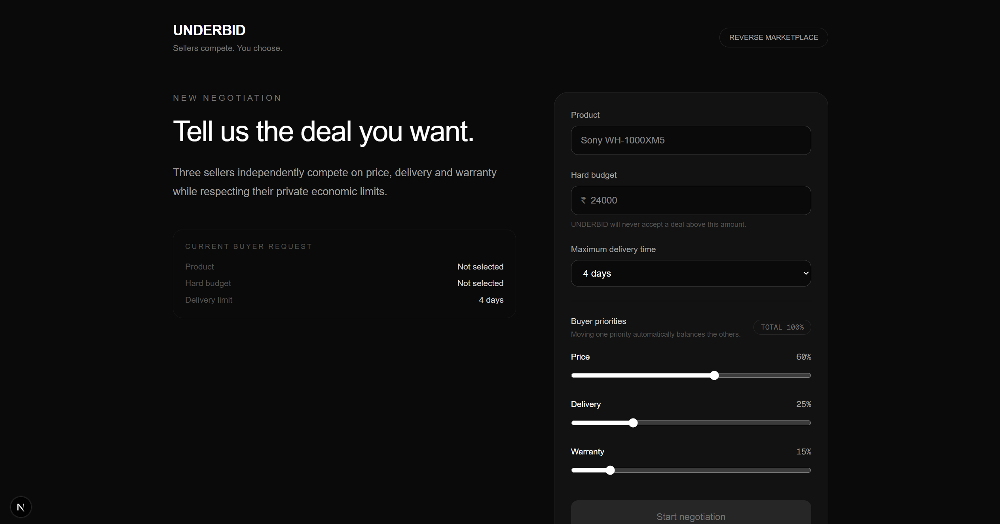
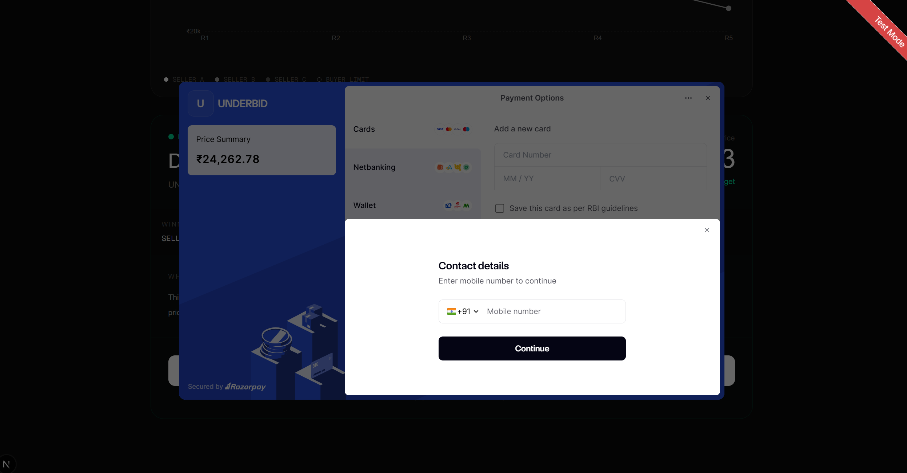
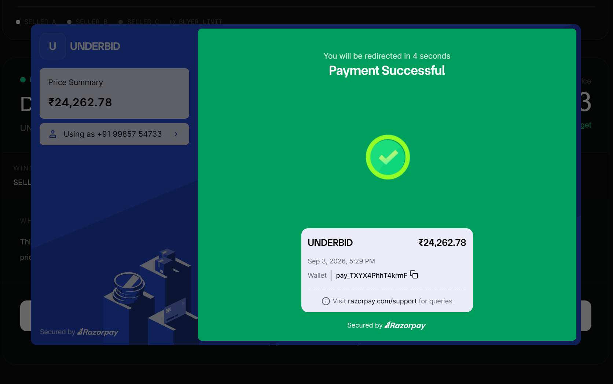
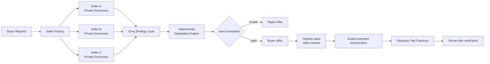

<div align="center">

# UNDERBID

### Three AI seller agents compete for one buyer — while deterministic code controls the money.

**A bounded agentic reverse marketplace for price, delivery, warranty, and test-mode payment.**

[](https://nextjs.org/)
[](https://fastapi.tiangolo.com/)
[](https://groq.com/)
[](https://razorpay.com/)
[](#real-time-negotiation)
[](#validation)

**Built for the Razorpay AI Buildathon 2026.**

</div>

---

## The idea

Online shopping still makes the buyer do the work:

> open tabs -> compare sellers -> trade off price vs delivery vs warranty -> decide manually.

**UNDERBID flips that flow.**

The buyer states a product, a **hard budget**, a delivery limit, and what matters most.

Then **three seller agents compete for the purchase**.

Each seller has private economics — opening price, floor, concession behavior, delivery options, warranty options, and add-on costs — and can never violate its own constraints.

The buyer never accepts an offer that violates theirs.

> **AI chooses the strategy. Code controls the economy. The user controls the money.**

---

## Demo

### 1. The buyer defines the deal



The retail anchor seeds the synthetic seller market.  
The buyer budget is a **separate hard acceptance ceiling** — it is not used to set seller prices.

---

### 2. Three sellers compete live


Each seller exposes:

- current offer,
- round number,
- AI-selected strategy,
- strategy rationale,
- delivery,
- warranty,
- add-ons,
- offer history,
- hard-constraint violations,
- buyer utility when valid.

The seller-private floor and cost are never exposed to the buyer.

---

### 3. Offers move across rounds


The engine runs a maximum of **5 simultaneous rounds**.

Every seller in round `R` only sees the completed public state of round `R-1`, so execution order does not give one seller an unfair informational advantage.

---

### 4. A valid deal is selected


In this run:

| Field | Result |
|---|---:|
| Typical retail anchor | ₹50,000 |
| Buyer hard budget | ₹45,000 |
| Winner | **SELLER B** |
| Final price | **₹44,327.60** |
| Delivery | 3 days |
| Warranty | 18 months |
| Rounds | 5 |

The winner is **not necessarily the cheapest seller**.

Only offers that satisfy every hard constraint are eligible, and the valid offer with the highest weighted buyer utility wins.

---

### 5. Payment requires explicit authorization



The frontend never tells the backend what amount to charge.

It sends the negotiation ID. The backend reloads the persisted final contract and creates the Razorpay Test order from the stored price.

```text
DEAL_FOUND
    v
buyer explicitly authorizes
    v
backend loads persisted final price
    v
Razorpay Test order
    v
checkout
    v
server-side signature verification
```

> **Razorpay is used in Test Mode. No real money is moved.**

---

### 6. Payment is verified server-side



Checkout success is not trusted blindly.

UNDERBID verifies the Razorpay response server-side before recording the payment as verified.

---

## Graceful failure is part of the product

A financial agent should know when **not** to transact.

With the same ₹50,000 retail anchor but a ₹30,000 hard budget:

<table>
<tr>
<td width="50%"></td>
<td width="50%"></td>
</tr>
</table>

All three sellers remain above the buyer's hard budget after the allowed negotiation rounds.

UNDERBID does **not** manufacture a deal.


```text
NO DEAL
5 / 5 rounds completed
No payment action initiated
```

That is a successful failure path, not an application error.

---

# The trust boundary

## AI can choose *what to try*. It cannot choose *economic truth*.

The LLM is used for bounded seller strategy selection.

Allowed actions:

```text
HOLD
CONCEDE_PRICE
ADD_VALUE
IMPROVE_TERMS
```

The model can also provide a short rationale.

It **cannot** directly decide:

```text
price
discount amount
seller floor
buyer budget
utility score
contract validity
winner
payment amount
payment authorization
```

| Decision | AI strategy layer | Deterministic engine |
|---|:---:|:---:|
| Choose negotiation tactic | Yes | |
| Explain tactic rationale | Yes | |
| Calculate exact offer price | | Yes |
| Enforce seller floor | | Yes |
| Enforce buyer budget | | Yes |
| Enforce delivery limit | | Yes |
| Compute buyer utility | | Yes |
| Select winner | | Yes |
| Derive payment amount | | Yes |
| Verify Razorpay response | | Yes |

### Why?

LLMs are useful for **qualitative strategy**.

They are a poor place to put financially consequential arithmetic or hard permissions.

So UNDERBID uses:

```text
LLM strategy proposal
        v
typed / bounded action
        v
deterministic economic engine
        v
hard-constraint validation
        v
structured offer
```

**Money is never probabilistic.**

---

# How the negotiation works



### Seller economics

Each synthetic seller privately owns parameters such as:

```text
cost price
opening price
hard floor
concession rate
delivery options
warranty options
add-on costs
personality / strategy
```

Important invariants:

```text
cost < floor < opening
seller never prices below floor
accepted price never exceeds buyer budget
accepted delivery never exceeds buyer limit
```

The current prototype does **not** scrape live merchant pricing.

A user-provided **typical retail price** anchors the synthetic seller market, while the buyer budget remains an independent hard constraint.

---

# Multi-attribute contracts

UNDERBID negotiates more than one number.

A contract contains:

```text
price
delivery days
warranty months
add-ons
```

The buyer controls the relative importance of:

- price,
- delivery,
- warranty.

Hard constraints are checked **before** utility.

So a fantastic warranty can never compensate for an offer that exceeds the buyer's budget.

### Deterministic tie-break

If valid offers have equal utility:

1. higher buyer utility,
2. lower price,
3. faster delivery,
4. longer warranty,
5. seller name.

No random winner selection.

---

# Real-time negotiation

The backend persists structured negotiation events and streams them to the frontend over WebSockets.

Events include:

```text
ROUND_STARTED
OFFER_CREATED
SELLER_WALKED
DEAL_FOUND
NO_DEAL
PAYMENT_ORDER_CREATED
PAYMENT_VERIFIED
```

That makes the negotiation auditable instead of hiding the final outcome behind an LLM response.

---

# Validation

UNDERBID was stress-tested across **1,000 randomized synthetic markets** covering different retail anchors, budgets, delivery constraints, preference weights, and seller economics.

| Metric | Result |
|---|---:|
| Markets tested | **1,000** |
| Economic invariant violations | **0** |
| Seller-floor violations | **0** |
| Buyer-budget violations | **0** |
| Delivery-constraint violations | **0** |
| Sellers that won at least once | **3 / 3** |
| Distinct winning prices | **348** |
| Agreements | 348 |
| No-deal outcomes | 652 |
| Average terminal round | 4.06 |
| Median terminal round | 5 |
| P95 terminal round | 5 |

The high no-deal rate is intentional.

The stress-test distribution deliberately includes buyer budgets as low as **60% of the retail anchor** and delivery requirements as strict as **1 day**.

This is a **safety/invariant stress test**, not a marketplace conversion benchmark.

### Local checks

```bash
python -m pytest -v
```

```text
Backend parity / privacy test: PASS
```

```bash
cd frontend
npm run lint
npm run build
```

```text
ESLint:                  PASS
Next.js production build: PASS
TypeScript:               PASS
Static generation:        PASS
```

---

# Payment safety

UNDERBID deliberately separates **agreement** from **payment authorization**.

### Server-controlled amount

The frontend does not send:

```text
charge = ₹44,327.60
```

It sends only the negotiation identity.

The backend reloads the persisted winner and final price, then creates the Razorpay Test order from those stored values.

### Additional safeguards

| Property | Enforcement |
|---|---|
| Seller cannot cross floor | deterministic seller engine |
| Invalid buyer contract cannot win | hard validation before utility |
| Frontend cannot choose charge amount | backend reloads persisted agreement |
| Payment cannot happen before agreement | payment endpoint requires final winner |
| Duplicate order creation is bounded | existing payment-order state reused |
| Razorpay secret stays server-side | environment variables |
| Checkout response is verified | server-side Razorpay signature verification |
| LLM failure does not corrupt money logic | deterministic fallback |
| Important actions are inspectable | structured event/audit trail |

---

# Tech stack

| Layer | Technology |
|---|---|
| Frontend | Next.js 16, React, TypeScript |
| Styling | Tailwind CSS |
| Visualization | Recharts |
| Backend | FastAPI, Python |
| Realtime | WebSockets |
| Validation | Pydantic |
| Persistence | SQLite + SQLModel |
| Money arithmetic | Python `Decimal` |
| Negotiation | Custom deterministic engine |
| AI strategy | Groq + Qwen |
| Payment | Razorpay Orders + Standard Checkout |
| Testing | Pytest, ESLint, Next.js production build |

No LangChain, CrewAI, AutoGen, Kafka, or other heavyweight orchestration layer is required.

The market state machine and economic rules are implemented directly so they remain easy to inspect.

---

# Run locally

## 1. Clone

```bash
git clone https://github.com/ziennaa/underbid.git
cd underbid
```

## 2. Backend

### Windows

```powershell
python -m venv .venv
.venv\Scripts\Activate.ps1
pip install -r requirements.txt
```

Create a root `.env`:

```env
GROQ_API_KEY=your_key_here
GROQ_MODEL=qwen/qwen3.6-27b

RAZORPAY_KEY_ID=your_test_key_id
RAZORPAY_KEY_SECRET=your_test_key_secret
```

> Use Razorpay **Test Mode** credentials only.

Start the API:

```powershell
uvicorn backend.main:app --reload
```

Backend:

```text
http://127.0.0.1:8000
```

API docs:

```text
http://127.0.0.1:8000/docs
```

## 3. Frontend

In another terminal:

```powershell
cd frontend
npm install
npm run dev
```

Open:

```text
http://localhost:3000
```

---

# API surface

```text
POST /api/negotiations
GET  /api/negotiations/{id}
POST /api/negotiations/{id}/start

WS   /ws/negotiations/{id}

POST /api/negotiations/{id}/payment/order
POST /api/negotiations/{id}/payment/verify
```

---

# Repository structure

```text
underbid/
├── backend/
│   ├── agents/
│   │   └── strategy.py
│   ├── database.py
│   ├── main.py
│   ├── manager.py
│   ├── models.py
│   ├── payments.py
│   ├── schemas.py
│   ├── seller_factory.py
│   └── service.py
│
├── negotiation/
│   ├── buyer.py
│   ├── engine.py
│   ├── seller.py
│   ├── utility.py
│   └── validate.py
│
├── frontend/
│   └── src/
│       ├── app/
│       ├── components/
│       └── lib/
│
├── tests/
│   └── test_phase3.py
│
├── docs/
│   ├── screenshots/
│   └── validation/
│
├── validate_markets.py
├── requirements.txt
└── README.md
```

---

# Prototype scope

### What it does

- genuine dynamic seller competition,
- private synthetic seller economics,
- multi-round negotiation,
- bounded LLM strategy decisions,
- deterministic hard-constraint enforcement,
- multi-attribute buyer utility,
- real-time WebSocket market visualization,
- graceful `NO_DEAL`,
- persisted audit events,
- Razorpay Test order creation,
- explicit buyer authorization,
- server-side payment signature verification.

### What it does **not** claim

- live Amazon / Croma / Reliance prices,
- real merchants behind Seller A/B/C,
- production inventory,
- real-money settlement,
- production fulfilment,
- merchant authentication.

The synthetic market exists so the negotiation mechanism can be stress-tested independently.

A production marketplace could replace the seller factory with merchant inventory/pricing adapters while preserving the same negotiation and payment boundaries.

---

# Demo challenge

The fastest way to prove UNDERBID is not scripted:

1. Enter a product and retail anchor.
2. Choose a budget.
3. Set your own price / delivery / warranty priorities.
4. Randomize the market.
5. Run the negotiation.
6. Run it again.
7. Lower the budget until the system refuses the deal.
8. On a successful market, explicitly authorize the Razorpay Test payment.

You should **not** be able to predict the winner before the market runs.

That is the point.

---

<div align="center">

### AI chooses the strategy. Code controls the economy. The user controls the money.

**UNDERBID**

</div>
